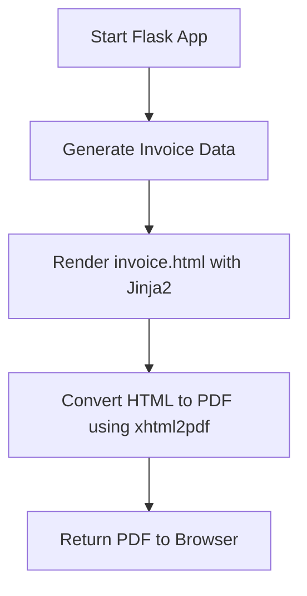

---

# 📄 Automatic Invoice Generator (Flask + Python)

A **web-based invoice generator** built with Python and Flask that renders an invoice from an HTML template and **generates a PDF invoice** using `xhtml2pdf`.

Users can view the invoice in the browser and download it as a PDF.

---

## 📌 Features

* Generate invoices dynamically using Python
* Render invoices using HTML + Jinja2
* Download invoices as PDF
* Simple and lightweight
* No external system dependencies
* Windows-friendly

---

## ⚙️ Tech Stack

* **Python 3.9+**
* **Flask** – Web framework
* **Jinja2** – HTML templating
* **xhtml2pdf** – PDF generation (pure Python)
* **HTML / CSS** – Invoice design

---

## 📁 Project Structure

```text
automatic_invoice_generator/
│
├── app.py                 # Flask application
├── templates/
│   └── invoice.html       # Invoice HTML template
├── static/
│   └── logo.png           # Optional company logo
├── env/                   # Virtual environment
├── requirements.txt       # Python dependencies
└── README.md
```

---

## 📦 Installation

### 1️⃣ Clone the repository

```bash
git clone https://github.com/amin3ltd/invoice-generator.git
cd automatic_invoice_generator
```

---

### 2️⃣ Create a virtual environment 

```bash
python -m venv env
env\Scripts\activate      # Windows
```

---

### 3️⃣ Install dependencies

```bash
pip install flask xhtml2pdf
```

(or)

```bash
pip install -r requirements.txt
```

---

## 🚀 Usage

### 1️⃣ Start the Flask app

```bash
python app.py
```

---

### 2️⃣ Open in browser

```
http://127.0.0.1:5000/
```

✔ View invoice in HTML format

---

### 3️⃣ Download PDF invoice

```
http://127.0.0.1:5000/download
```

✔ Invoice is generated and returned as a PDF

---

## 🔍 How It Works



---

## ⚠️ Notes & Limitations

* `xhtml2pdf` supports **basic CSS only**

  * Avoid flexbox, grid, media queries
* Layout should be **table-based**
* Fonts must be explicitly configured for Unicode
* Logo paths may require adjustment for PDF rendering

---

## 📈 Future Improvements

* Add tax & discount calculation
* Save invoices to disk
* Add invoice numbering system
* Support multiple invoice templates
* Email invoices automatically
* Add Amharic / multilingual support

---

## 👤 Author

**Your Name**
GitHub: [https://github.com/amin3ltd](https://github.com/amin3ltd)

---

## ✅ Status

✔ Stable
✔ Windows-compatible
✔ No system libraries
✔ No external executables

---

