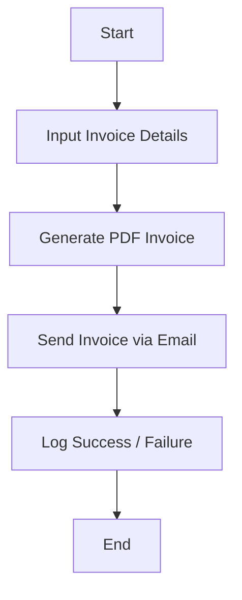

---

# 📄 Automatic Invoice Generator (Python)

A Python program that **automatically generates invoices** in PDF format and sends them via email to the respective recipients.
Simply provide the invoice details as input, and the program handles the rest.

---

## 📌 Features

* Automatically generate PDF invoices
* Input invoice details (recipient, items, prices, taxes, etc.)
* Send invoices via email to clients
* Customizable invoice templates
* Supports multiple recipients
* Lightweight and easy to configure

---

## ⚙️ Tech Stack

* **Python 3.9+**
* **ReportLab** – Generate PDF invoices
* **SMTP / smtplib** – Send emails
* **Jinja2** (optional) – Templating for invoice design
* **CSV / JSON** – Input invoice data

---

## 📁 Project Structure

```text
invoice-generator/
│
├── generate_invoice.py    # Main program to create and email invoices
├── templates/             # Folder for PDF or HTML templates
├── data/                  # Optional folder for CSV / JSON invoice data
├── requirements.txt       # Dependencies
└── README.md
```

---

## 📦 Installation

### 1️⃣ Clone the repository

```bash
git clone https://github.com/amin3ltd/invoice-generator.git
cd invoice-generator
```

---

### 2️⃣ Create a virtual environment (recommended)

```bash
python -m venv env
source env/bin/activate   # Linux / macOS
env\Scripts\activate      # Windows
```

---

### 3️⃣ Install dependencies

```bash
pip install -r requirements.txt
```

---

## 🚀 Usage

1. Open `generate_invoice.py`
2. Provide invoice details:

* Recipient Name
* Email Address
* Items & Prices
* Taxes (if applicable)
* Invoice Number / Date

3. Run the program:

```bash
python generate_invoice.py
```

4. PDF invoice will be generated and **emailed automatically**.

---

## 🔍 Workflow Overview



---

## ⚠️ Notes & Limitations

* Ensure your **email credentials** are correct (SMTP setup required)
* PDF template customization is optional but recommended
* The program does **not validate email addresses** automatically
* This is for **educational and business purposes only**

---

## 📈 Future Improvements

* Support multiple invoice templates
* Automatically calculate taxes and discounts
* Attach invoices to bulk emails
* Store invoice history in a database
* Integrate with cloud services (Gmail API, AWS SES)

---

## 👤 Author

**Your Name**
GitHub: [https://github.com/amin3ltd](https://github.com/amin3ltd)

---


